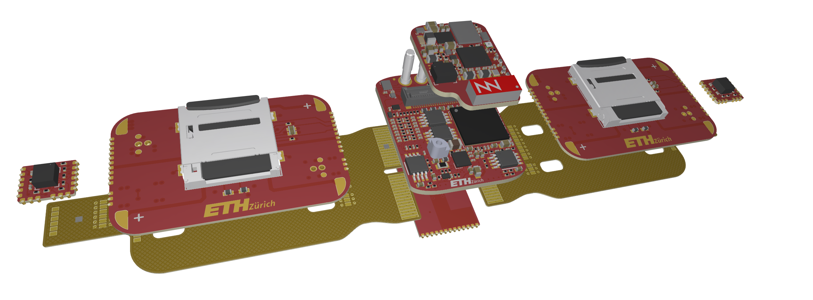
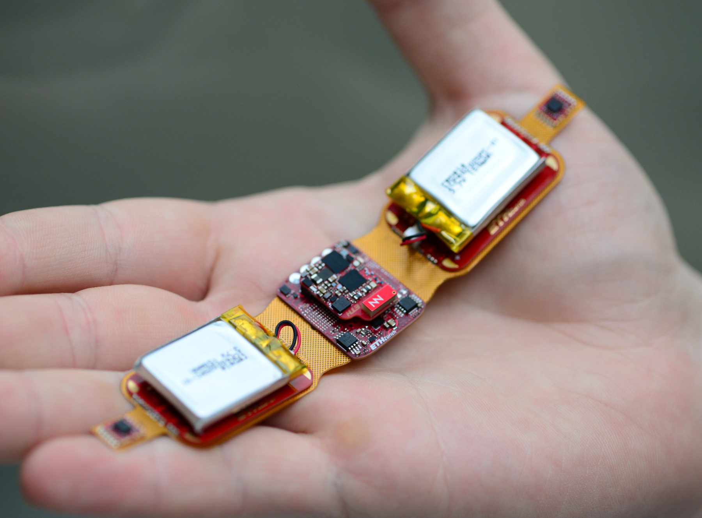
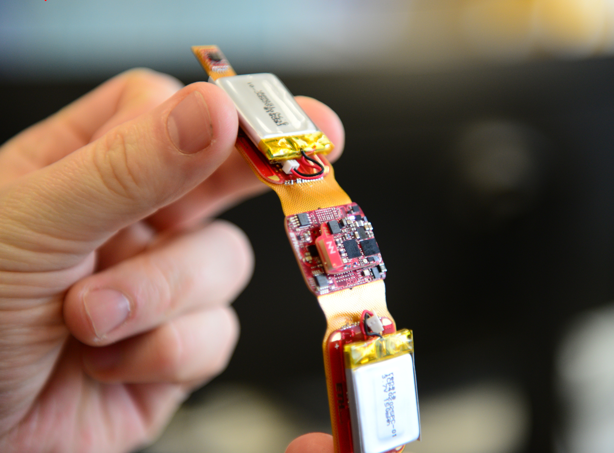

+++
title="PATCH-IT"
description="A modular chest-patch with integrated PPG, ECG, bio impedance, body temperature, and seismocardiographical sensors."
template="project_page.html"
weight=303

[extra]
thumbnail_img="patchit_hand.jpeg"
disable_toc=true
+++


  Exploded View.



  
    <small> (📸 Frank K. Gürkaynak, 2023) </small>
  
  
    <small> (📸 Frank K. Gürkaynak, 2023) </small>
  


A modular chest-patch with integrated PPG, ECG, bio impedance, body temperature, and seismocardiographical sensors.
Based around the [VitalCore](@/projects/VitalCore/index.md) controller.
