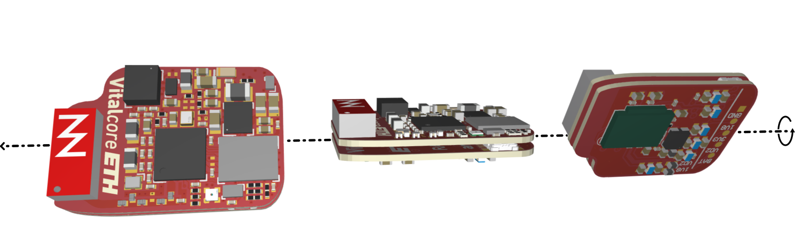
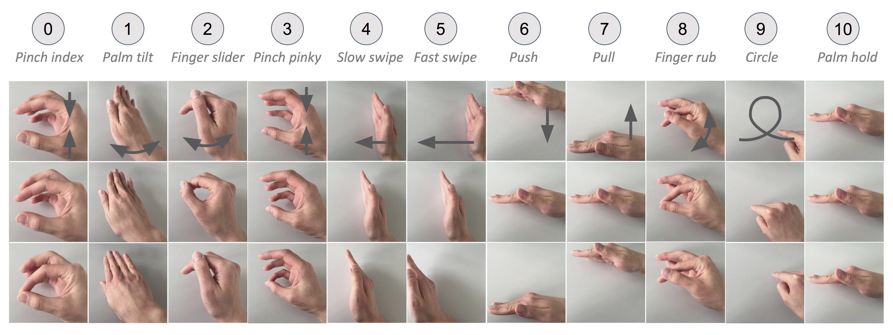
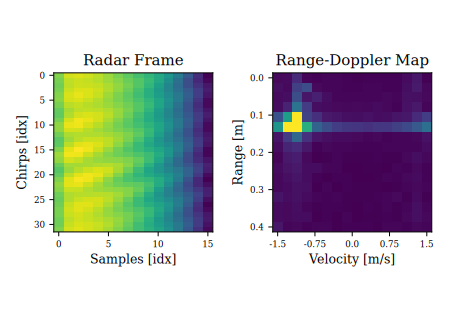
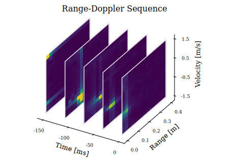
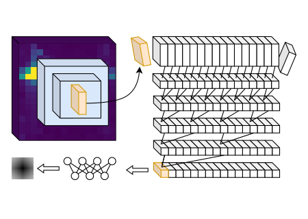
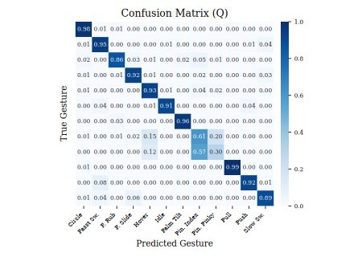
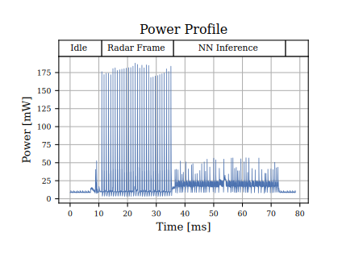

+++
title="RadarBud"
description="A low-power in-ear hand-gesture recognition system based on 50GHz mm-wave radars, efficient spatial and temporal Convolutional neural networks, and an energy-optimized hardware design."
template="project_page.html"
weight=201

[extra]
thumbnail_img="radarbud_in_hand.jpeg"
+++

{{  }}

{{ <toc.inline_toc/> }}

## Overview

A low-power in-ear Hand-Gesture Recognition system based on 50GHz mm-wave radars, efficient spatial and temporal Convolutional neural networks and an energy-optimized hardware design.

This project was spearheaded by Andrea Ronco, who developed the whole algorithm and software during his master's thesis. You can find his write-up of the project [here](https://www.andrearonco.com/posts/2024/06/tinyssimoradar/).
I contributed the main controller board (a [VitalCore](@/projects/VitalCore/index.md)), physical design, and some firmware components.

## Paper

We published a paper about this project, which you can find below. It contains more details about the
radar and hand gesture recognition pipeline.

📚  [Andrea Ronco, Philipp Schilk, Michele Magno, "TinyssimoRadar: In-Ear Hand Gesture Recognition with Ultra-Low Power mmWave Radars", *IoTDI24*, 2024.](https://ieeexplore.ieee.org/abstract/document/10562162)

## Hardware

{{  }}

The RadarBud is built on my [VitalCore](/projects/vitalcore/) platform: a tiny controller board that
features a fairly capable NRF53 SoC, full power and battery management, an IMU, a BLE antenna, and
some extra flash. We extended it using a purpose-built "RadarPack" extension board, which features
an Infinion radar and its supporting circuitry.

{{  }}
This stack is then placed in a custom case that was manufactured using a resin 3D printer. Besides
the PCBs, the case also holds a 70mAh battery, a charge connector, and a power switch.

## Operation


The set of gestures, as defined by [Wang et al](https://dl.acm.org/doi/10.1145/2984511.2984565). Figure taken from [Wang et al.](https://dl.acm.org/doi/10.1145/2984511.2984565)


The RadarBud is capable of classifying within the set of 11 gestures, as defined by [Wang et al.](https://dl.acm.org/doi/10.1145/2984511.2984565) and pictured above. The
dataset that was acquired for this project with these gestures is available [here](https://www.research-collection.ethz.ch/handle/20.500.11850/672242).


    Example of a raw radar frame, and the generated Range-Doppler map.
    A sequence of Range-Doppler maps, which are the input to the CNN.
    Depiction of the two convolutional stages, and final multi-layer perceptron.

The radar generates a sequence of frames, each of which contains a number of radar chirps. Through an FFT, each radar frame
is first converted into the Range-Doppler domain, yielding a two-dimensional range versus relative speed mapping.

The actual inference is performed using a multi-stage convolutional neural network (CNN), as is shown in the illustration
above. Each frame is first pre-processed using a two-dimensional CNN in the Range-Doppler domain, generating a set of
features that is fed into a 16-stage shift buffer, serving as an input to a temporal convolutional network (TCN). The final
prediction is then generated with a small Multi-Layer Perceptron (MLP).

For more details on the algorithmic details, please take a look at our paper linked above.

## Performance


    Confusion Matrix of the quantized Network.
    Power profile of an acquisition and inference.


The final quantized model is only 36KiB large, with a single inference time of 32.4ms on the VitalCore's NRF5340, and is
capable of achieving a prediction accuracy of up to 94.9% under the right conditions. For all the details and caveats -
including a detailed power analysis - see our paper linked above.

## Links + References

- 🌍 [Andrea's Post](https://www.andrearonco.com/posts/2024/06/tinyssimoradar/)
- 📚 [Paper](https://ieeexplore.ieee.org/abstract/document/10562162)
- 📚 [Wang et al.](https://dl.acm.org/doi/10.1145/2984511.2984565)
- 📁 [Repo](https://github.com/ETH-PBL/TinyssimoRadar)
- ⚙️ [VitalCore](@/projects/VitalCore/index.md)
- ⚙️ [Data Set](https://www.research-collection.ethz.ch/handle/20.500.11850/672242)

Our paper may be cited as follows:
```bibtex
@inproceedings{TinyssimoRadar,
  author={Ronco, Andrea and Schilk, Philipp and Magno, Michele},
  booktitle={2024 IEEE/ACM Ninth International Conference on Internet-of-Things
    Design and Implementation (IoTDI)},
  title={TinyssimoRadar: In-Ear Hand Gesture Recognition with Ultra-Low Power
    mmWave Radars},
  year={2024},
  pages={192-202},
  doi={10.1109/IoTDI61053.2024.00021}
}
```
